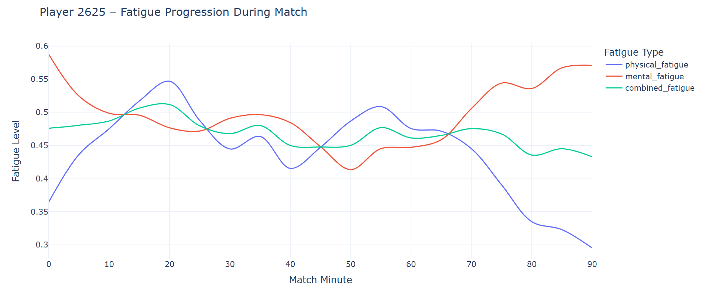
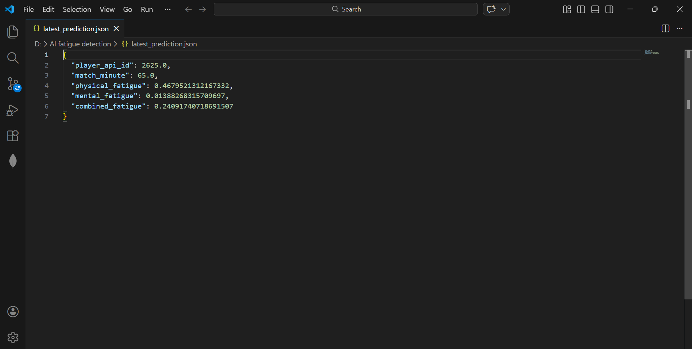

# 🧠 NeuroPlay – AI-Powered Athlete Fatigue Detection System

Predicting Physical & Mental Fatigue in Football Players using Machine Learning

# 🚀 Project Overview

NeuroPlay is an AI-based fatigue detection system that predicts and analyzes physical and mental fatigue levels in football players using historical performance data.

The system uses the European Soccer Database, performs feature engineering to simulate fatigue accumulation, and trains an XGBoost regression model to forecast fatigue progression over time.

This project demonstrates how data science + machine learning + visualization can enhance sports analytics and performance monitoring.

# 🎯 Project Goal

The main objective of this project is to:

Analyze player performance data

Estimate physical and mental fatigue levels

Predict future fatigue progression

Visualize fatigue trends interactively

Provide a foundation for real-time sports analytics systems

# ⚽ Dataset Used
European Soccer Database (Kaggle)

Contains:

25,000+ matches

10,000+ players

Player attributes (stamina, strength, agility, vision, etc.)

Match history from 2008–2016

Stored as a SQLite database and queried using Python.

# 🧠 Fatigue Modeling Approach

1️⃣ Physical Fatigue Factors

Stamina

Strength

Distance covered

Sprint count

Speed

2️⃣ Mental Fatigue Factors

Vision

Reaction delay

Error rate

Agility (used as composure proxy)

# 🧮 Combined Fatigue Formula

Combined Fatigue = 0.5 × Physical Fatigue + 0.5 × Mental Fatigue

Features normalized using Z-score

Rolling averages applied to capture fatigue accumulation

Output scaled between 0 (fresh) and 1 (fully fatigued)

🤖 Machine Learning Model
Model Used:

XGBoost Regressor

Why XGBoost?

Handles non-linear relationships

High performance on structured data

Built-in regularization

Fast training

Evaluation Metric:

RMSE (Root Mean Square Error)
	​
RMSE = sqrt( (1/n) * Σ (y - ŷ)² )

Lower RMSE indicates better prediction accuracy.

# 📊 Visualization

Interactive fatigue trends are generated using:

Plotly

Line charts for physical, mental, and combined fatigue

JSON export for web integration

# 🌐 Web Application

The system includes a lightweight web interface (app.py) to:

Display fatigue predictions

Visualize trends

Load latest model output

Enable integration with AI Studio or deployment platforms

# 🛠️ Technologies Used

Python

Pandas

NumPy

SQLite

Scikit-learn

XGBoost

Plotly

Streamlit

# ⚙️ Installation & Setup

1️⃣ Clone Repository
git clone https://github.com/Srinikesh-Mucha/neuroplay-fatigue-detection-system.git
cd neuroplay-fatigue-detection

2️⃣ Create Virtual Environment
python -m venv .venv

Activate:

Windows:

.venv\Scripts\activate

Mac/Linux:

source .venv/bin/activate

3️⃣ Install Dependencies
pip install -r requirements.txt

▶️ Running the Project
Train the Model
python model_train.py
Run Web App
python app.py

# 📈 Example Output

Fatigue trend line charts

JSON file: latest_prediction.json

Model RMSE printed in terminal

# 🌍 Real-World Impact
For Coaches

Identify fatigue buildup

Optimize substitutions

Reduce injury risk

For Players

Track recovery trends

Monitor workload balance

For Analysts

Correlate fatigue with performance drop

For Fans (Future Scope)

AR-based fatigue overlay during matches

# 🚀 Future Enhancements

Real-time wearable integration

LSTM-based time-series modeling

Live match fatigue tracking

AR visualization for fan engagement

Gemini AI explanation layer
